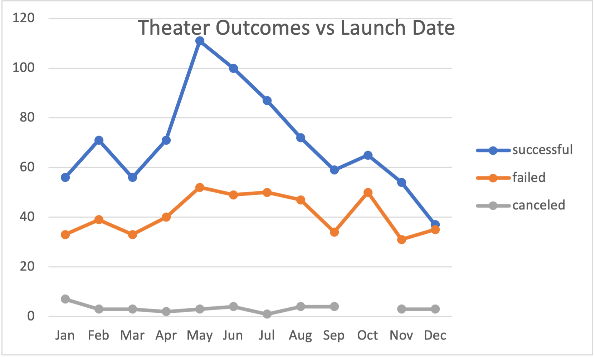
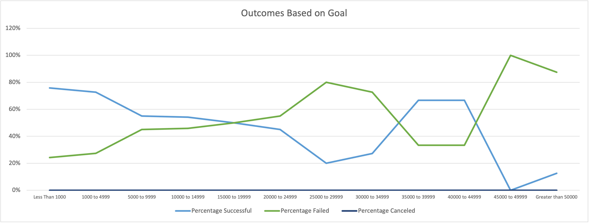

# Kickstarter-analysis.

## Overview of Project

### Purpose
To help Louise with her project campaign by analyzing crowdfunding data to determine the trends. 

## Analysis and Challenges

### Analysis of Outcomes Based on Launch Date
I created a pivot table from the Kickstarter worksheet to show the number of successful, failed, and canceled projects by each month. Then I filtered the table based on "Parent Category" and chose "theater" for Parent category. Finally, I created a line chart from the pivot table to visualize the relationship between outcomes and launch month for "theater". 
From the table and chart I created, Louise could have a better idea which season/months would be the best time to launch the campaigns.

### Analysis of Outcomes Based on Goals
I used COUNTIFS() function to populate the "Number Successful", "Number Failed", and "Number Canceled" for "plays" based on each goal range from the Kickstarter worksheet. Then I used the SUM() function to calculate the number of "Total Projects" for each goal range. Based on the data I created, I calculated the percentages of successful, failed, and canceled projects for each goal range. Finally, I created a line chart to visualize the relationship between outcomes and goal amounts. From the table and chart I created, Louise could have a better idea which goal range would have the highest success rate. 

### Challenges and Difficulties Encountered
Before I used COUNTIFS() function to populate the "Number Successful", "Number Failed", and "Number Canceled" for the subcategory "plays" from the Kickstarter worksheet, I filtered the "plays" for subcategory column on Kickstarter worksheet. I assumed that I did not have to add a criterion for subcategory="plays" on COUNTIFS() fuction, because Kickstarter worksheet was already filtered for the "plays". But the populated numbers were too high for "plays" and I realized that it was actually populated based on the all subcategories and need to add a criterion for subcategory="plays". I learned that I need to be more cautious when using the filtered data. 

 
## Results

- What are two conclusions you can draw about the Outcomes based on Launch Date?
Theaters that launched on May have the most successful outcomes. June and July are the next most successful months, which suggests that late-spring to mid-summer would be the best season to launch the campaigns. Also, the December was the most unsuccessful month and had roughly the same number of failed campaigns launched. 

- What can you conclude about the Outcomes based on Goals?
The goal amount between $1,000 to $4,999 saw the most successes, followd by goal amount less than $1,000. However, goal amount less than $1,000 saw a slightly higher rate of success at 76% compared goal amount between $1,000 and $4,999 at 73%. According to data, there would be better chance of being successful if goal amount is lower. 

- What are some limitations of this dataset?
The total number of projects for goal amounts from $25,000 to $49,999 are relatively low -- this results in the data being easily skewed and lead to invalid conclusions. For example, the goal range from $45,000 to $49,999 only had one project which failed, showing a 100% failure rate and can lead to us believing that this goal range is always going to fail. 

- What are some other possible tables and/or graphs that we could create?
We could calculate the successful, failed, canceled rate for each month and create a line chart based on the rate.
